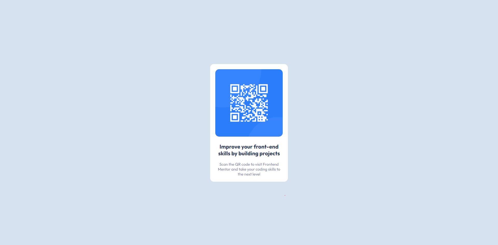
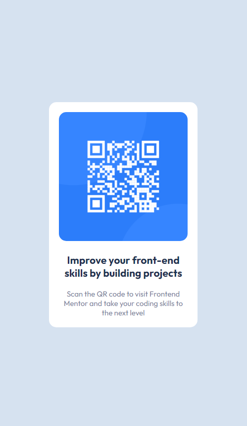

# Frontend Mentor - QR code component solution

This is a solution to the [QR code component challenge on Frontend Mentor](https://www.frontendmentor.io/challenges/qr-code-component-iux_sIO_H). Frontend Mentor challenges help you improve your coding skills by building realistic projects. 

## Table of contents

- [Overview](#overview)
  - [Screenshot](#screenshot)
  - [Links](#links)
- [My process](#my-process)
  - [Built with](#built-with)
  - [What I learned](#what-i-learned)
  - [Useful resources](#useful-resources)
- [Author](#author)
- [Acknowledgments](#acknowledgments)

## Overview

This is a very simple project that introduces frontend developers to being given a design that needs to be brought to life. No advanced techniques are necessary, but it is a nice real-world example of how you might be asked to make a component for a project.

### Screenshot

### Links

- Solution URL: [GitHub](https://github.com/tdtatum2/QR-Code-Component)
- Live Site URL: [GitHub Pages](https://tdtatum2.github.io/QR-Code-Component)

## My process

I started by inspecting the provided designs. I decided to use responsive containers, but maintain a set size for the actual card component that was to hold the QR Code image, the title, and the text. This is because I noticed that the card in the desktop design was "small" compared to the screen, but filled nearly the entire screen on mobile. After noting various important aspects (border-radius, text alignment, etc.) and determining that I would use a react-bootstrap Card component, I looked into the provided style guide. After initializing a new React app, I made sure to create variables to store the provided colours, as well as import the provided font family. Creating the variables to store colours made me more confident in my ability to match the design as closely as possible, and I always prefer to use variables when developing in case colour schemes change at some point. From there, it was as simple as plugging the image and information into the react-bootstrap Card component!

### Built with

- CSS custom properties
- Flexbox
- [React](https://reactjs.org/) - JS library
- [React Bootstrap](https://react-bootstrap.github.io/) - Bootstrap library rebuilt for React

### What I learned

This project gave me a better look at the experience of being given a design to develop from scratch. While earning my degree, we generally start with an idea: "create an application that has a list of items you can search through", for example. Designing the application was left entirely to us as the developers. While this freedom was fun to work with, it could also leave some students stumped. It was also unrealistic compared to real world scenarios.

Additionally, I learned a lot about the importance of reflection. This project was the first time I sat down and created an in-depth Read Me file. It was incredible to learn the powers of a Markdown file when it comes to documentation and organization.

### Useful resources

- [React Bootstrap Documentation (Cards)](https://react-bootstrap.github.io/components/cards/) - Reviewing the documentation for the card component was very useful and easy to adapt to.
- [React GitHub Pages](https://github.com/gitname/react-gh-pages) - A very useful source for learning to properly deploy a React application to GitHub pages.

## Author

- Website - [Fin Tatum](https://www.fintatum.com)
- Frontend Mentor - [@tdtatum2](https://www.frontendmentor.io/profile/tdtatum2)